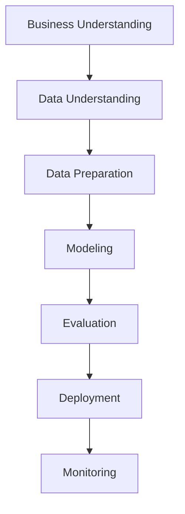
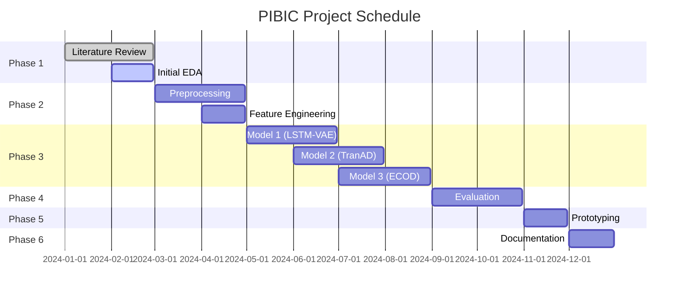

# 🛢️ Petrobras Offshore Wells Anomaly Detection

[](https://www.python.org/downloads/)
[](https://opensource.org/licenses/MIT)
[](https://github.com/psf/black)
[](https://github.com/astral-sh/ruff)

> **🇧🇷 [Ver documentação em Português Brasileiro](docs/README.pt-BR.md)**

## 🎯 Project Overview

This is a **PIBIC (Graduate Research) project 2025-2026** focused on **anomaly detection in multivariate time series** from Petrobras offshore wells. The project leverages state-of-the-art machine learning and deep learning techniques to identify operational anomalies in real-time drilling and production data.

## 👨‍💻 Authors and Contributors

### 🎓 Rafael Alves - Lead Developer

<div align="center">
  
</div>

Currently pursuing a Bachelor's degree in Control and Process Automation Engineering at UFBA, I am an enthusiast passionate about logic and knowledge, especially in Artificial Intelligence (AI).

Throughout my journey, I have sought projects that have enhanced my skills in:

- **Machine Learning** - Development and implementation of AI models
- **Data Analysis** - Processing and visualization of complex data
- **Python** - Development of robust and scalable solutions

In addition to being an aspiring engineer and data scientist, I am a digital marketing manager specializing in Google Ads and a micro-entrepreneur, strengthening my holistic vision.

## 🏛️ Institutional Affiliation

**Risk Studies Center (CER-UFBA)**
Department of Statistics (DEst)
Federal University of Bahia (UFBA)
📍 Ondina, Salvador-BA, Brazil
🌐 [cer.ufba.br](https://cer.ufba.br) | [ufba.br](https://ufba.br)

CER-UFBA is an emerging research laboratory of the Department of Statistics (DEst) at the Federal University of Bahia (UFBA), located in Ondina, Salvador-BA, created in 2016. Its main objective is to bring together researchers involved in the study, proposal of statistical procedures, and risk data analysis.

This project is developed under the academic supervision and research infrastructure of CER-UFBA, contributing to the center's mission of advancing statistical methodologies for risk assessment and anomaly detection in complex industrial systems.

### 🎓 CER-UFBA Research Areas

- **Statistical Risk Analysis**: Advanced methodologies for risk assessment
- **Time Series Analysis**: Multivariate and univariate time series modeling
- **Anomaly Detection**: Statistical and machine learning approaches
- **Industrial Applications**: Oil & gas, manufacturing, and critical systems
- **Data Science**: Big data analytics and statistical computing

## 🚀 Key Features

- **Multivariate Time Series Analysis**: Handles complex interdependencies between multiple well parameters
- **State-of-the-Art Models**: Implements TranAD, LSTM-VAE, USAD, ECOD, and PyOD algorithms
- **Real-time Processing**: Optimized for high-frequency offshore well data
- **Interpretable Results**: SHAP-based model explanations for operational decisions
- **Cloud-Ready**: AWS and GCP deployment configurations included

## 🏗️ Architecture

```
petrobras-offshore-wells-anomaly-detection/
├── src/                    # Core source code
│   ├── models/            # ML/DL model implementations
│   ├── data/              # Data processing pipelines
│   ├── features/          # Feature engineering
│   └── utils/             # Utility functions
├── notebooks/             # Jupyter interactive notebooks
├── data/                  # Datasets and processed data
├── tests/                 # Automated test suite
├── docs/                  # Documentation
├── config/                # Configuration files
├── docker/                # Containerization
└── scripts/               # Automation scripts
```

The project aligns with CER-UFBA's mission to:

- Foster interdisciplinary research in statistical risk analysis
- Develop practical applications of statistical methodologies
- Contribute to the advancement of Brazilian oil & gas industry safety
- Train students in cutting-edge statistical and data science techniques

## 🛠️ Technology Stack

### Core Technologies

- **Python 3.11+** - Modern Python with type hints
- **Polars** - High-performance data manipulation (faster than Pandas)
- **Jupyter** - Interactive notebooks for collaborative development
- **uv** - Fast Python package manager and environment management

### Machine Learning & Deep Learning

- **PyTorch** - Deep learning framework
- **Scikit-learn** - Traditional ML algorithms
- **Optuna** - Hyperparameter optimization
- **SHAP** - Model interpretability

### Data Science & Visualization

- **Plotly** - Interactive visualizations
- **ydata-profiling** - Automated EDA
- **tslearn** - Time series learning utilities

### Cloud & Deployment

- **AWS** - Cloud infrastructure and ML services
- **GCP** - Google Cloud Platform integration
- **MLflow** - Model lifecycle management
- **Docker** - Containerization

## 🚀 Quick Start

### Prerequisites

- Python 3.11+
- uv package manager
- Git
- Zsh (recommended for enhanced development experience)

### Installation

1. **Clone the repository**

   ```bash
   git clone https://github.com/your-username/petrobras-offshore-wells-anomaly-detection.git
   cd petrobras-offshore-wells-anomaly-detection
   ```

2. **Install uv (if not already installed)**

   ```bash
   curl -LsSf https://astral.sh/uv/install.sh | sh
   ```

3. **Create virtual environment and install dependencies**

   ```bash
   uv sync
   ```

4. **Configure Zsh (Recommended)**

   ```bash
   # Run the automated setup script
   ./scripts/setup_zsh.sh

   # Or manually copy configurations
   cp .zshrc ~/
   cp .zshrc.project ~/
   source ~/
   ```

5. **Activate the environment**
   ```bash
   source .venv/bin/activate  # Linux/macOS
   # or
   .venv\Scripts\activate     # Windows
   ```

### 🐚 Enhanced Zsh Configuration

This project includes a comprehensive Zsh configuration with:

- **Custom prompt** with Petrobras branding and Git integration
- **Project-specific aliases** for common development tasks
- **Environment variables** for all project directories
- **Useful functions** for data science workflows
- **Plugin integration** (Oh My Zsh, autosuggestions, syntax highlighting)

**Key features:**

- `project_status` - Check project status
- `run_pipeline` - Execute complete anomaly detection pipeline
- `run_experiment <name>` - Run specific experiments
- `monitor_training` - Monitor model training with TensorBoard and MLflow
- `check_code_quality` - Verify code quality with linting and type checking

See [ZSH Configuration Documentation](docs/ZSH_CONFIGURATION.md) for detailed setup instructions.

### Running the Project

1. **Start Jupyter Lab**

   ```bash
   jupyter lab notebooks/
   ```

2. **Run anomaly detection models**

   ```bash
   python src/main.py
   ```

3. **Execute tests**
   ```bash
   pytest tests/
   ```

### Task Runner with `just`

This project uses `just` as a command runner to simplify common development tasks. The `justfile` at the root of the project contains various recipes for linting, formatting, testing, and running the application.

**1. Install `just`**

You need to install `just` on your system. Follow the instructions for your OS here: [**`just` installation guide**](https://github.com/casey/just#installation).

For example, on macOS or Linux with Homebrew:

```bash
brew install just
```

**2. List available commands**

To see all available commands, run:

```bash
just --list
```

**3. Common commands**

- `just install`: Install all project dependencies.
- `just lint`: Check code quality.
- `just format`: Format all code.
- `just test`: Run all tests.
- `just run`: Run the main application.
- `just clean`: Remove cache and build files.

## 📊 Usage Examples

### Basic Anomaly Detection

```python
from src.models import TranADModel
from src.data import WellDataProcessor

# Load and preprocess well data
processor = WellDataProcessor()
data = processor.load_data("well_001.csv")

# Initialize and train model
model = TranADModel()
model.train(data)

# Detect anomalies
anomalies = model.detect_anomalies(data)
```

### Interactive Analysis with Jupyter

```python
# In Jupyter notebook
import polars as pl
import polars as pl

# Load data
df = pl.read_csv("data/well_data.csv")

# Interactive visualization
mo.md(f"## Well Data Analysis\n\nDataset shape: {df.shape}")
```

## 📚 Documentation

### Core Documentation

- **[Setup Guide](docs/setup-guide.md)** - Complete project setup instructions
- **[Claude Code Setup](docs/CLAUDE_CODE_SETUP.md)** - Claude Code configuration and optimization
- **[3W Integration](docs/3W_INTEGRATION.md)** - Integration with 3W system
- **[3W Project Overview](docs/3W_OVERVIEW_EN.md)** - Complete overview of Petrobras 3W project
- **[AWS Setup](docs/AWS_SETUP.md)** - AWS deployment and configuration
- **[GCP Setup](docs/GCP_SETUP.md)** - Google Cloud Platform setup
- **[Authors and Contributors](docs/AUTHORS.md)** - Meet the project team

### Development Guidelines

- **[Conventional Commits](docs/CONVENTIONAL_COMMITS.md)** - Git commit standards
- **[Contributing Guidelines](CONTRIBUTING.md)** - How to contribute to the project

## 🔬 Research Focus

### Anomaly Detection Challenges

- **Multivariate Dependencies**: Complex relationships between well parameters
- **Real-time Processing**: High-frequency data streams from offshore sensors
- **Operational Context**: Domain-specific anomaly definitions
- **Interpretability**: Explainable AI for operational decisions

### Model Performance Metrics

- **AUC-PR**: Precision-Recall curves for imbalanced data
- **F1-Score**: Balanced precision and recall
- **Detection Latency**: Time to anomaly identification
- **False Positive Rate**: Operational efficiency considerations

## 🧪 Testing

```bash
# Run all tests
pytest

# Run with coverage
pytest --cov=src

# Run specific test categories
pytest tests/test_models.py
pytest tests/test_data_processing.py
```

## 🚀 Performance Optimization

- **Polars**: 10-100x faster than Pandas for large datasets
- **Vectorized Operations**: Optimized numerical computations
- **Memory Management**: Efficient data structures for time series
- **Parallel Processing**: Multi-core support for model training

## 🌟 Contributing

We welcome contributions! Please see our [Contributing Guidelines](CONTRIBUTING.md) for details.

### Development Setup

```bash
# Install development dependencies
uv sync --group dev

# Install pre-commit hooks
pre-commit install

# Run code quality checks
ruff check src/
black src/
mypy src/
```

## 📄 License

This project is licensed under the MIT License - see the [LICENSE](LICENSE.md) file for details.

### 📞 Contact Information

- **CER-UFBA Website**: [cer.ufba.br](https://cer.ufba.br)
- **UFBA Main Site**: [ufba.br](https://ufba.br)
- **Location**: Department of Statistics, Ondina Campus, Salvador-BA, Brazil
- **Research Focus**: Statistical risk analysis, time series, anomaly detection, industrial applications

### 🔬 Join Our Research

CER-UFBA welcomes collaboration with:

- **Students**: Undergraduate and graduate research opportunities
- **Researchers**: Academic partnerships and joint publications
- **Industry**: Applied research projects and consulting
- **Institutions**: Research collaboration and knowledge exchange

---

**📚 This project is proudly developed under the academic supervision of CER-UFBA, contributing to the advancement of statistical methodologies for industrial risk assessment and anomaly detection.**

---

> **🇧🇷 [Ver documentação em Português Brasileiro](docs/README.pt-BR.md)**

<div align="center">
  <sub>Built with ❤️ for offshore well safety and efficiency</sub>
</div>

---

### ✅ Implemented

- [ ] Exploratory Data Analysis (EDA)
- [ ] Data Preprocessing and Cleaning
- [ ] Advanced Feature Engineering
- [ ] Implementation of SOTA Models
- [ ] Comparative Performance Evaluation
- [ ] API Prototype for Inference
- [ ] Containerization with Docker
- [ ] Basic CI/CD with GitHub Actions

### 🔄 In Development

- [ ] Training of Selected Models
- [ ] Hyperparameter Optimization
- [ ] Interpretability Analysis

### 📋 Planned

- [ ] User Interface for Monitoring
- [ ] Final PIBIC Report

## 📊 Dataset

### Petrobras 3W Dataset

- **Type**: Multivariate Time Series
- **Variables**: Pressure, temperature, flow rate, vibration
- **Characteristics**:
  - Large volume of data
  - High dimensionality
  - Interdependence between variables
  - Rare and unpredictable anomalous events

### 🎯 Special Focus

- **Equipment Failures**: Identification of incipient problems
- **Flow Instabilities**: Monitoring of abnormal operations

## 📈 Methodology

### 🔄 Adapted CRISP-DM



### 📊 Project Phases

| Phase          | Duration   | Main Activities                       |
| -------------- | ---------- | ------------------------------------- |
| 🎯 **Phase 1** | Month 1-2  | Literature review, initial EDA        |
| 🔧 **Phase 2** | Month 3-4  | Preprocessing, feature engineering    |
| 🤖 **Phase 3** | Month 5-8  | Implementation and training of models |
| 📊 **Phase 4** | Month 9-10 | Evaluation, interpretability          |
| 🚀 **Phase 5** | Month 11   | Prototyping, MLOps                    |
| 📝 **Phase 6** | Month 12   | Documentation, final report           |

## 📅 Schedule

### 📅 Overview (12 months)



### 📋 Key Milestones

- [x] **Month 2**: Complete EDA and data dictionary
- [ ] **Month 4**: Clean and preprocessed dataset
- [ ] **Month 8**: 3+ models implemented and trained
- [ ] **Month 10**: Complete comparative evaluation
- [ ] **Month 11**: Functional prototype
- [ ] **Month 12**: Final PIBIC report

## 🎯 SMART Goals

### 🎯 Main Objective

**Investigate, implement, and evaluate the effectiveness of innovative ML/DL models for anomaly detection in multivariate time series from the 3W dataset.**

### 📊 Key Results (KRs)

| KR      | Description                                               | Deadline | Status         |
| ------- | --------------------------------------------------------- | -------- | -------------- |
| **KR1** | Complete exploratory analysis and preprocessing           | Month 4  | 🔄 In progress |
| **KR2** | Implementation of 3+ SOTA models                          | Month 8  | ⏳ Pending     |
| **KR3** | Comparative analysis and identification of the best model | Month 10 | ⏳ Pending     |
| **KR4** | Basic containerized prototype                             | Month 11 | ⏳ Pending     |
| **KR5** | Final PIBIC report and documentation                      | Month 12 | ⏳ Pending     |

## 🔬 Implemented Models

### 🏆 Selected Models (SOTA - Last 3 years)

| Model        | Type                    | Characteristics            | Status               |
| ------------ | ----------------------- | -------------------------- | -------------------- |
| **TranAD**   | Transformer             | Long temporal dependencies | 🔄 In implementation |
| **LSTM-VAE** | RNN + Autoencoder       | Sequence modeling          | 🔄 In implementation |
| **USAD**     | Adversarial Autoencoder | Fast training              | ⏳ Pending           |
| **ECOD**     | Non-parametric          | Interpretable, scalable    | ⏳ Pending           |

### 🎯 Special Focus: Anomaly Detection

- **Specific features**: Pressure/flow rate variation rates
- **Cross-correlations**: Relationships between multiple sensors
- **Temporal analysis**: Evolution patterns of anomalies
- **Efficient processing**: Use of Polars for real-time analysis of large data volumes

## 📊 Evaluation Metrics

### 🎯 Main Metrics

| Metric          | Description                           | Importance             |
| --------------- | ------------------------------------- | ---------------------- |
| **AUC-PR**      | Area under the Precision-Recall curve | High (imbalanced data) |
| **F1-Score**    | Harmonic mean of precision and recall | High                   |
| **Precision@k** | Precision in the top-k predictions    | Medium                 |
| **Recall@k**    | Recall in the top-k predictions       | Medium                 |

### 📈 Comparison Baselines

- **Isolation Forest**: Classic outlier detection algorithm
- **One-Class SVM**: Class separation method
- **LOF (Local Outlier Factor)**: Density-based detection
