# 🛢️ Petrobras Offshore Wells Anomaly Detection Control Charts

[](https://www.python.org/downloads/)
[](LICENSE)
[](https://github.com/RafaelAlvesTech/petrobras-offshore-wells-anomaly-detection-control-charts)
[](https://www.gov.br/cnpq/pt-br/acesso-a-informacao/acoes-e-programas/programas/programas-de-bolsa-de-iniciacao-cientifica)
[](https://cloud.google.com/)

> **Detecção de Anomalias em Séries Temporais Multivariadas de Poços Offshore da Petrobras utilizando Modelos de Machine Learning Inovadores e Gráficos de Controle**

## 📋 Índice

- [🎯 Visão Geral](#-visão-geral)
- [🚀 Funcionalidades](#-funcionalidades)
- [📊 Dataset](#-dataset)
- [🛠️ Tecnologias](#️-tecnologias)
- [☁️ Google Cloud Platform](#️-google-cloud-platform)
- [📁 Estrutura do Projeto](#-estrutura-do-projeto)
- [⚡ Instalação e Configuração](#-instalação-e-configuração)
- [📈 Metodologia](#-metodologia)
- [📅 Cronograma](#-cronograma)
- [🎯 Objetivos SMART](#-objetivos-smart)
- [🔬 Modelos Implementados](#-modelos-implementados)
- [📊 Métricas de Avaliação](#-métricas-de-avaliação)
- [🚀 Deployment](#-deployment)
- [📚 Documentação](#-documentação)
- [🤝 Contribuição](#-contribuição)
- [📄 Licença](#-licença)

## 🎯 Visão Geral

Este projeto PIBIC foca na **detecção de anomalias em operações de poços de petróleo offshore**, utilizando modelos inovadores de Machine Learning para analisar séries temporais multivariadas complexas. O objetivo é identificar eventos críticos como falhas de equipamento e instabilidades de fluxo de forma precoce e precisa.

### 🌟 Destaques

- 🔍 **Análise Multivariada**: Processamento de múltiplas variáveis interdependentes (pressão, temperatura, vazão, vibração)
- 🤖 **Modelos SOTA**: Implementação dos algoritmos mais recentes em detecção de anomalias
- 📊 **Gráficos de Controle**: Visualização avançada para monitoramento em tempo real
- ☁️ **Google Cloud**: Treinamento distribuído e escalável na nuvem

## 🚀 Funcionalidades

### ✅ Implementadas
- [ ] Análise exploratória de dados (EDA)
- [ ] Pré-processamento e limpeza de dados
- [ ] Engenharia de atributos avançada
- [ ] Implementação de modelos SOTA
- [ ] Avaliação comparativa de performance
- [ ] Protótipo de API para inferência
- [ ] Containerização com Docker
- [ ] CI/CD básico com GitHub Actions
- [x] **Integração com Google Cloud Platform**
- [x] **Treinamento distribuído na nuvem**
- [x] **Experiment tracking com MLflow**

### 🔄 Em Desenvolvimento
- [ ] Treinamento dos modelos selecionados
- [ ] Otimização de hiperparâmetros
- [ ] Análise de interpretabilidade

### 📋 Planejadas
- [ ] Interface de usuário para monitoramento
- [ ] Relatório final PIBIC

## 📊 Dataset

### Dataset 3W da Petrobras
- **Tipo**: Séries temporais multivariadas
- **Variáveis**: Pressão, temperatura, vazão, vibração
- **Características**:
  - Grande volume de dados
  - Alta dimensionalidade
  - Interdependência entre variáveis
  - Eventos anômalos raros e imprevisíveis

### 🎯 Foco Especial
- **Falhas de equipamento**: Identificação de problemas incipientes
- **Instabilidades de fluxo**: Monitoramento de operações anormais

## 🛠️ Tecnologias

### 🐍 Linguagens e Frameworks
- **Python 3.11**: Linguagem principal (versão LTS)
- **PyTorch/TensorFlow**: Deep Learning
- **Scikit-learn**: Machine Learning tradicional
- **Pandas/NumPy**: Manipulação de dados
- **Polars**: Manipulação de dados de alta performance (alternativa ao Pandas)
- **Matplotlib/Seaborn**: Visualização
- **Marimo**: Notebooks interativos Python modernos

### ☁️ Google Cloud Platform
- **Vertex AI**: Treinamento e deployment de modelos
- **AI Platform**: Treinamento distribuído
- **Cloud Storage**: Armazenamento de dados e modelos
- **Cloud Build**: CI/CD automatizado
- **Cloud Run**: Servidor MLflow
- **Cloud Logging & Monitoring**: Observabilidade

### 📦 Gerenciamento de Dependências
- **uv**: Gerenciador de pacotes Python moderno e rápido
- **pyproject.toml**: Configuração centralizada do projeto
- **requirements.txt**: Dependências tradicionais (compatibilidade)

### 🔧 Ferramentas de Desenvolvimento
- **Docker**: Containerização
- **Git/GitHub**: Versionamento
- **GitHub Actions**: CI/CD
- **Optuna**: Otimização de hiperparâmetros
- **PyOD**: Detecção de outliers
- **pre-commit**: Hooks de qualidade de código
- **Marimo**: Notebooks interativos e desenvolvimento colaborativo
- **MLflow**: Experiment tracking e model registry

## ☁️ Google Cloud Platform

### 🚀 Treinamento Distribuído

O projeto está configurado para treinamento de modelos na Google Cloud Platform, oferecendo:

- **Escalabilidade**: Treinamento em múltiplas GPUs e máquinas
- **Custo-efetividade**: Pagamento apenas pelo uso
- **Integração**: Seamless integration com MLflow e experiment tracking
- **Automação**: CI/CD pipeline para treinamento automático

### 🏗️ Arquitetura

```
┌─────────────────┐    ┌──────────────────┐    ┌─────────────────┐
│   Local Dev     │    │   Google Cloud   │    │   MLflow UI     │
│                 │    │                  │    │                 │
│ ┌─────────────┐ │    │ ┌──────────────┐ │    │ ┌─────────────┐ │
│ │   Code      │ │───▶│ │ Vertex AI    │ │───▶│ │ Experiments │ │
│ │             │ │    │ │              │ │    │ │             │ │
│ └─────────────┘ │    │ └──────────────┘ │    │ └─────────────┘ │
│                 │    │                  │    │                 │
│ ┌─────────────┐ │    │ ┌──────────────┐ │    │ ┌─────────────┐ │
│ │   Data      │ │───▶│ │ Cloud Storage│ │───▶│ │ Model      │ │
│ │             │ │    │ │              │ │    │ │ Registry   │ │
│ └─────────────┘ │    │ └──────────────┘ │    │ └─────────────┘ │
└─────────────────┘    └──────────────────┘    └─────────────────┘
```

### 🔧 Serviços Utilizados

| Serviço | Propósito | Configuração |
|---------|-----------|--------------|
| **Vertex AI** | Treinamento e deployment | n1-standard-4 + T4 GPU |
| **AI Platform** | Treinamento distribuído | Scale tier: BASIC_GPU |
| **Cloud Storage** | Dados e modelos | Bucket com versioning |
| **Cloud Build** | CI/CD pipeline | Build automático |
| **Cloud Run** | MLflow server | 2GB RAM, 1 CPU |
| **Cloud Logging** | Monitoramento | Logs estruturados |

### 📊 Configuração de Treinamento

```yaml
# Exemplo de configuração para LSTM-VAE
training:
  model: lstm_vae
  epochs: 150
  batch_size: 64
  learning_rate: 0.0001
  machine_type: n1-standard-4
  accelerator: NVIDIA_TESLA_T4
  worker_count: 2
```

### 🚀 Quick Start

1. **Configurar GCP**:
   ```bash
   export GOOGLE_CLOUD_PROJECT="your-project-id"
   export GOOGLE_CLOUD_REGION="us-central1"
   export GCS_BUCKET_NAME="your-bucket-name"

   chmod +x scripts/setup_gcp.sh
   ./scripts/setup_gcp.sh
   ```

2. **Instalar dependências**:
   ```bash
   uv sync
   ```

3. **Treinar modelo**:
   ```bash
   python examples/train_lstm_vae_gcp.py \
     --data-path data/your_data.csv \
     --model-name my-model \
     --epochs 100
   ```

### 📈 Monitoramento

- **MLflow**: Tracking de experimentos e métricas
- **TensorBoard**: Visualização de treinamento
- **Cloud Logging**: Logs centralizados
- **Cloud Monitoring**: Métricas e alertas

### 💰 Estimativa de Custos

| Serviço | Custo/Hora | Uso Estimado | Custo Mensal |
|----------|------------|--------------|--------------|
| Vertex AI (n1-standard-4 + T4) | $0.47 | 10 horas | $4.70 |
| Cloud Storage | $0.02/GB | 100 GB | $2.00 |
| Cloud Build | $0.003/min | 30 min | $0.09 |
| **Total** | - | - | **~$6.79** |

*Estimativas baseadas em uso moderado. Custos reais podem variar.*

## 📁 Estrutura do Projeto

```
petrobras-offshore-wells-anomaly-detection-control-charts/
├── 📁 src/
│   ├── 📁 gcp/                    # ☁️ Integração Google Cloud
│   │   ├── __init__.py
│   │   ├── config.py              # Configuração GCP
│   │   ├── auth.py                # Autenticação
│   │   ├── storage.py             # Cloud Storage
│   │   ├── vertex_ai.py           # Vertex AI
│   │   ├── training.py            # AI Platform Training
│   │   └── mlflow_integration.py  # MLflow + GCS
│   ├── 📁 models/                 # Modelos de ML
│   ├── 📁 data/                   # Processamento de dados
│   ├── 📁 utils/                  # Utilitários
│   └── 📁 evaluation/             # Avaliação de modelos
├── 📁 examples/                   # Exemplos de uso
│   └── train_lstm_vae_gcp.py     # 🚀 Treinamento na nuvem
├── 📁 notebooks/                  # Notebooks Marimo
├── 📁 data/                       # Datasets
├── 📁 scripts/                    # Scripts de automação
│   └── setup_gcp.sh              # 🚀 Setup automático GCP
├── 📁 docker/                     # Containerização
│   └── mlflow.Dockerfile         # MLflow server
├── 📁 .github/workflows/          # CI/CD
│   └── gcp-training.yml          # 🚀 Pipeline de treinamento
├── 📁 docs/                       # Documentação
├── 📄 gcp-config.yaml            # ⚙️ Configuração GCP
├── 📄 env.example                 # 📝 Variáveis de ambiente
├── 📄 mlflow-requirements.txt     # 📦 Requirements MLflow
├── 📄 pyproject.toml             # 📦 Configuração do projeto
└── 📄 README.md                   # 📚 Este arquivo
```

## ⚡ Instalação e Configuração

### 🚀 Setup Automático Completo

Para uma configuração completa e automática do ambiente de desenvolvimento:

#### 🔌 **1. Instalar Extensões do VS Code/Cursor**
```bash
# Linux/macOS
chmod +x scripts/install_extensions.sh
./scripts/install_extensions.sh

# Windows (PowerShell)
.\scripts\install_extensions.ps1

# Cross-platform (Python)
python scripts/install_extensions.py
```

#### 🐍 **2. Configurar Ambiente Python**
```bash
# Clone o repositório
git clone https://github.com/RafaelAlvesTech/petrobras-offshore-wells-anomaly-detection-control-charts.git
cd petrobras-offshore-wells-anomaly-detection-control-charts

# Instalar uv e criar ambiente
curl -LsSf https://astral.sh/uv/install.sh | sh
uv venv
source .venv/bin/activate  # Linux/Mac
# ou
.venv\Scripts\activate     # Windows

# Instalar dependências
uv sync
```

#### ⚙️ **3. Configurar Pre-commit Hooks**
```bash
uv run pre-commit install
```

### 🆕 Por que usar uv, Marimo e Polars?

O **uv** é um gerenciador de pacotes Python moderno que oferece:
- ⚡ **Velocidade**: 10-100x mais rápido que pip
- 🔒 **Reproduzibilidade**: Lock files para dependências exatas
- 🐍 **Compatibilidade**: Funciona com ferramentas existentes
- 🚀 **Simplicidade**: Comandos intuitivos e configuração automática

O **Marimo** é uma ferramenta moderna para notebooks Python que oferece:
- 🎯 **Interatividade**: Widgets e componentes reativos
- 🔄 **Reatividade**: Atualizações automáticas baseadas em dependências
- 🚀 **Performance**: Execução rápida e eficiente
- 🤝 **Colaboração**: Desenvolvimento em equipe simplificado

O **Polars** é uma biblioteca de manipulação de dados de alta performance que oferece:
- ⚡ **Velocidade**: 10-100x mais rápido que Pandas para operações complexas
- 🔄 **Paralelização**: Processamento automático em múltiplos núcleos
- 🐍 **Sintaxe Familiar**: API similar ao Pandas para fácil migração
- 🚀 **Memória Eficiente**: Uso otimizado de memória para grandes datasets

### 📋 Pré-requisitos
- Python 3.11+
- uv (gerenciador de pacotes Python moderno)
- Marimo (notebooks interativos Python)
- Polars (manipulação de dados de alta performance)
- Docker (opcional)
- Git

### 🚀 Instalação Rápida

```bash
# 1. Clone o repositório
git clone https://github.com/RafaelAlvesTech/petrobras-offshore-wells-anomaly-detection-control-charts.git
cd petrobras-offshore-wells-anomaly-detection-control-charts

# 2. Instale o uv (se ainda não tiver)
curl -LsSf https://astral.sh/uv/install.sh | sh
# ou via pip
pip install uv

# 3. Instale o Marimo (notebooks interativos)
uv add marimo

# 4. Instale o Polars (manipulação de dados de alta performance)
uv add polars

# 5. Crie e ative o ambiente virtual com uv
uv venv
source .venv/bin/activate  # Linux/Mac
# ou
.venv\Scripts\activate     # Windows

# 6. Instale as dependências
uv pip install -r requirements.txt
# ou sincronize o projeto (recomendado)
uv sync
```

# 7. Configure as variáveis de ambiente
cp .env.example .env
# Edite o arquivo .env com suas configurações
```

### 🐳 Com Docker

```bash
# Build da imagem
docker build -t anomaly-detection .

# Executar o container
docker run -p 8000:8000 anomaly-detection
```

### 🔧 Configuração Avançada

```bash
# Instalar pre-commit hooks
uv run pre-commit install

# Executar testes
uv run pytest

# Executar linting
uv run ruff check .

# Iniciar Marimo (notebooks interativos)
uv run marimo edit

# Benchmark de performance (Polars vs Pandas)
uv run python -c "import polars as pl; print('Polars version:', pl.__version__)"

# Atualizar dependências
uv sync --upgrade

# Verificar dependências desatualizadas
uv sync --check
```

### 🎯 **Extensões Recomendadas**
O projeto inclui scripts automáticos para instalar as extensões essenciais baseadas nas suas configurações pessoais do VSCode:

| Categoria | Extensões | Descrição |
|-----------|-----------|-----------|
| 🐍 **Python** | ms-python.python, ms-python.vscode-pylance, ms-python.debugpy, ms-python.isort, charliermarsh.ruff | Desenvolvimento Python completo |
| 📊 **Data Science** | ms-toolsai.jupyter, ms-toolsai.jupyter-keymap | Notebooks Jupyter e Marimo |
| 🔧 **Dev Tools** | ms-vscode.vscode-json, yzhang.markdown-all-in-one, esbenp.prettier-vscode | Suporte a JSON, Markdown e formatação |
| 🐳 **Docker** | ms-azuretools.vscode-docker, ms-kubernetes-tools.vscode-kubernetes-tools | Containerização e Kubernetes |
| 🔄 **Git** | eamodio.gitlens, donjayamanne.githistory, github.vscode-github-actions | Git supercharged e GitHub Actions |
| 🎨 **Themes** | pkief.material-icon-theme, github.github-vscode-theme, johnpapa.vscode-peacock | Temas e cores personalizadas |
| 🧪 **Testing** | littlefoxteam.vscode-python-test-adapter, firsttris.vscode-jest-runner | Test runners Python e JavaScript |
| 🚀 **AI** | GitHub.copilot, GitHub.copilot-chat, visualstudioexptteam.vscodeintellicode | Assistente de IA e IntelliCode |
| 🔍 **Code Quality** | sonarsource.sonarlint-vscode, streetsidesoftware.code-spell-checker | Análise de código e spell checker |
| 🛠️ **Utilities** | chakrounanas.turbo-console-log, gruntfuggly.todo-tree, wallabyjs.quokka-vscode | Ferramentas de produtividade |

## 📈 Metodologia

### 🔄 CRISP-DM Adaptado

```mermaid
graph TD
    A[Entendimento do Negócio] --> B[Entendimento dos Dados]
    B --> C[Preparação dos Dados]
    C --> D[Modelagem]
    D --> E[Avaliação]
    E --> F[Deployment]
    F --> G[Monitoramento]
```



### 📊 Fases do Projeto

| Fase | Duração | Atividades Principais |
|------|---------|----------------------|
| 🎯 **Fase 1** | Set-Out/2025 | Revisão bibliográfica, EDA inicial |
| 🔧 **Fase 2** | Nov-Dez/2025 | Pré-processamento, engenharia de atributos |
| 🤖 **Fase 3** | Jan-Abr/2026 | Implementação e treinamento dos modelos |
| 📊 **Fase 4** | Mai-Jun/2026 | Avaliação, interpretabilidade |
| 🚀 **Fase 5** | Jul/2026 | Prototipagem, MLOps |
| 📝 **Fase 6** | Ago/2026 | Documentação, relatório final |

## 📅 Cronograma

### 📅 Visão Geral (12 meses)

```mermaid
gantt
    title Cronograma do Projeto PIBIC
    dateFormat  YYYY-MM-DD
    section Fase 1
    Revisão Bibliográfica    :         des1, 2025-09-01, 2025-10-31
    EDA Inicial             :         des2, 2025-10-01, 2025-10-31
    section Fase 2
    Pré-processamento       :         des3, 2025-11-01, 2025-12-31
    Engenharia de Atributos :         des4, 2025-12-01, 2025-12-31
    section Fase 3
    Modelo 1 (LSTM-VAE)     :         des5, 2026-01-01, 2026-02-28
    Modelo 2 (TranAD)       :         des6, 2026-02-01, 2026-03-31
    Modelo 3 (ECOD)         :         des7, 2026-03-01, 2026-04-30
    section Fase 4
    Avaliação               :         des8, 2026-05-01, 2026-06-30
    section Fase 5
    Prototipagem            :         des9, 2026-07-01, 2026-07-31
    section Fase 6
    Documentação            :         des10, 2026-08-01, 2026-08-31
```



### 📋 Marcos Principais

- [ ] **Mês 2 (Out/2025)**: EDA completa e dicionário de dados
- [ ] **Mês 4 (Dez/2025)**: Dataset limpo e pré-processado
- [ ] **Mês 8 (Abr/2026)**: 3+ modelos implementados e treinados
- [ ] **Mês 10 (Jun/2026)**: Avaliação comparativa completa
- [ ] **Mês 11 (Jul/2026)**: Protótipo funcional
- [ ] **Mês 12 (Ago/2026)**: Relatório final PIBIC

## 🎯 Objetivos SMART

### 🎯 Objetivo Principal
**Investigar, implementar e avaliar a eficácia de modelos inovadores de ML/DL para detecção de anomalias em séries temporais multivariadas do dataset 3W.**

### 📊 Key Results (KRs)

| KR | Descrição | Prazo | Status |
|----|-----------|-------|--------|
| **KR1** | Análise exploratória completa e pré-processamento | Mês 4 | 🔄 Em andamento |
| **KR2** | Implementação de 3+ modelos SOTA | Mês 8 | ⏳ Pendente |
| **KR3** | Análise comparativa e identificação do melhor modelo | Mês 10 | ⏳ Pendente |
| **KR4** | Protótipo básico containerizado | Mês 11 | ⏳ Pendente |
| **KR5** | Relatório final PIBIC e documentação | Mês 12 | ⏳ Pendente |

## 🔬 Modelos Implementados

### 🏆 Modelos Selecionados (SOTA - Últimos 3 anos)

| Modelo | Tipo | Características | Status |
|--------|------|----------------|--------|
| **TranAD** | Transformer | Dependências temporais longas | 🔄 Em implementação |
| **LSTM-VAE** | RNN + Autoencoder | Modelagem de sequências | 🔄 Em implementação |
| **USAD** | Autoencoder Adversarial | Treinamento rápido | ⏳ Pendente |
| **ECOD** | Não-paramétrico | Interpretável, escalável | ⏳ Pendente |


### 🎯 Foco Especial: Detecção de Anomalias

- **Features específicas**: Taxas de variação de pressão/vazão
- **Correlações cruzadas**: Relações entre múltiplos sensores
- **Análise temporal**: Padrões de evolução das anomalias
- **Processamento eficiente**: Uso do Polars para análise de grandes volumes de dados em tempo real

## 📊 Métricas de Avaliação

### 🎯 Métricas Principais

| Métrica | Descrição | Importância |
|---------|-----------|-------------|
| **AUC-PR** | Área sob curva Precision-Recall | Alta (dados desbalanceados) |
| **F1-Score** | Média harmônica de precisão e recall | Alta |
| **Precision@k** | Precisão nos top-k predições | Média |
| **Recall@k** | Recall nos top-k predições | Média |

### 📈 Baselines de Comparação

- **Isolation Forest**: Algoritmo clássico de detecção de outliers
- **One-Class SVM**: Método de separação de classes
- **LOF (Local Outlier Factor)**: Detecção baseada em densidade local

## 🚀 Deployment

### 🐳 Containerização

```dockerfile
# Dockerfile exemplo
FROM python:3.9-slim
WORKDIR /app
COPY requirements.txt .
RUN pip install -r requirements.txt
COPY . .
EXPOSE 8000
CMD ["python", "src/api/main.py"]
```

### 🌐 API REST

```python
# Exemplo de endpoint
POST /api/v1/predict
{
    "data": [[timestamp, pressure, temperature, flow, vibration]],
    "model": "lstm-vae"
}

Response:
{
    "anomaly_score": 0.85,
    "is_anomaly": true,
    "confidence": 0.92
}
```

### 🔄 CI/CD Pipeline

```yaml
# .github/workflows/ci.yml
name: CI/CD Pipeline
on: [push, pull_request]
jobs:
  test:
    runs-on: ubuntu-latest
    steps:
      - uses: actions/checkout@v2
      - name: Run tests
        run: pytest
      - name: Build Docker image
        run: docker build -t anomaly-detection .
```

## 📚 Documentação

### 📖 Documentos Disponíveis

- [📋 README.md](README.md) - Este arquivo
- [🚀 Setup Guide](docs/setup-guide.md) - Guia completo de configuração
- [📊 Dataset Documentation](docs/dataset.md) - Documentação do dataset 3W
- [🔧 API Reference](docs/api.md) - Referência da API
- [🤖 Model Documentation](docs/models.md) - Documentação dos modelos
- [📈 Results](docs/results.md) - Resultados e análises
- [📓 Marimo Notebooks](notebooks/) - Notebooks interativos para EDA e experimentos

### 📝 Relatórios

- [📊 Relatório PIBIC](docs/pibic-report.md) - Relatório final do projeto
- [📈 Apresentação](docs/presentation.md) - Slides da apresentação
- [🔬 Metodologia](docs/methodology.md) - Detalhes metodológicos

## 🤝 Contribuição

### 👥 Como Contribuir

1. **Fork** o projeto
2. **Clone** o repositório
3. **Crie** uma branch para sua feature (`git checkout -b feature/AmazingFeature`)
4. **Commit** suas mudanças (`git commit -m 'Add some AmazingFeature'`)
5. **Push** para a branch (`git push origin feature/AmazingFeature`)
6. **Abra** um Pull Request

### 📋 Padrões de Contribuição

- **Commits**: Use [Conventional Commits](https://www.conventionalcommits.org/)
- **Código**: Siga as diretrizes PEP 8 para Python
- **Documentação**: Mantenha o README atualizado
- **Testes**: Adicione testes para novas funcionalidades
- **Dependências**: Use `uv add <package>` para adicionar novas dependências
- **Ambiente**: Sempre use `uv sync` para sincronizar o ambiente
- **Notebooks**: Use Marimo para desenvolvimento interativo e colaborativo
- **Dados**: Use Polars para operações de dados de alta performance

### 🐛 Reportando Bugs

- Use o template de issue para bugs
- Inclua informações sobre o ambiente
- Adicione logs e screenshots quando relevante

## 📄 Licença

Este projeto está licenciado sob a Licença MIT - veja o arquivo [LICENSE](LICENSE) para detalhes.

## 🙏 Agradecimentos

- **Petrobras** pelo dataset 3W
- **CNPq** pelo suporte via PIBIC
- **Orientador** pela orientação acadêmica
- **Comunidade open source** pelas ferramentas utilizadas

## 📞 Contato

- **Autor**: [Rafael Alves]
- **Email**: [rafaelpereiraalves@ufba.br]
- **GitHub**: [@RafaelAlvesTech](https://github.com/RafaelAlvesTech)
- **LinkedIn**: [@rafaelalvestech](https://linkedin.com/in/rafaelalvestech)

---

<div align="center">

**⭐ Se este projeto foi útil para você, considere dar uma estrela! ⭐**

[](https://github.com/RafaelAlvesTech/petrobras-offshore-wells-anomaly-detection-control-charts/stargazers)
[](https://github.com/RafaelAlvesTech/petrobras-offshore-wells-anomaly-detection-control-charts/network/members)
[](https://github.com/RafaelAlvesTech/petrobras-offshore-wells-anomaly-detection-control-charts/issues)

</div>
